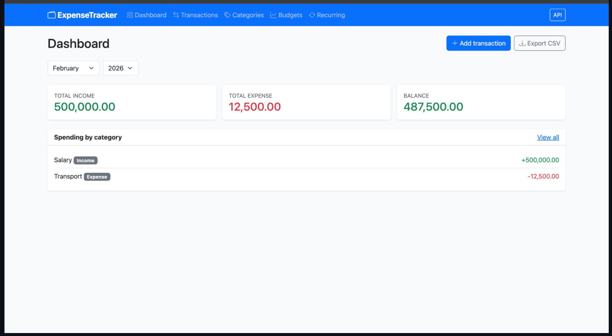
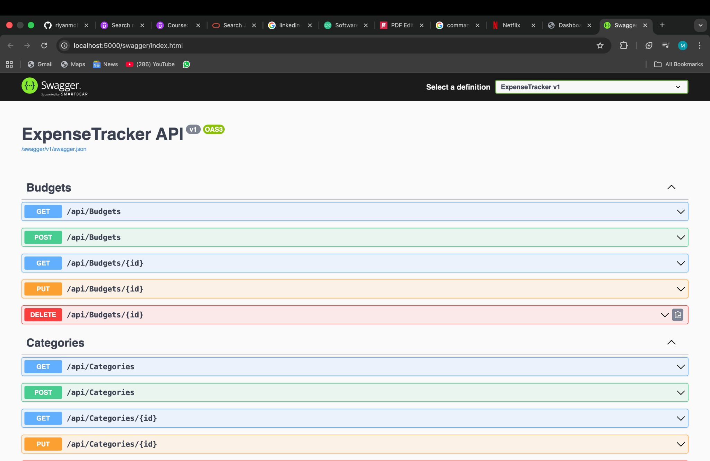
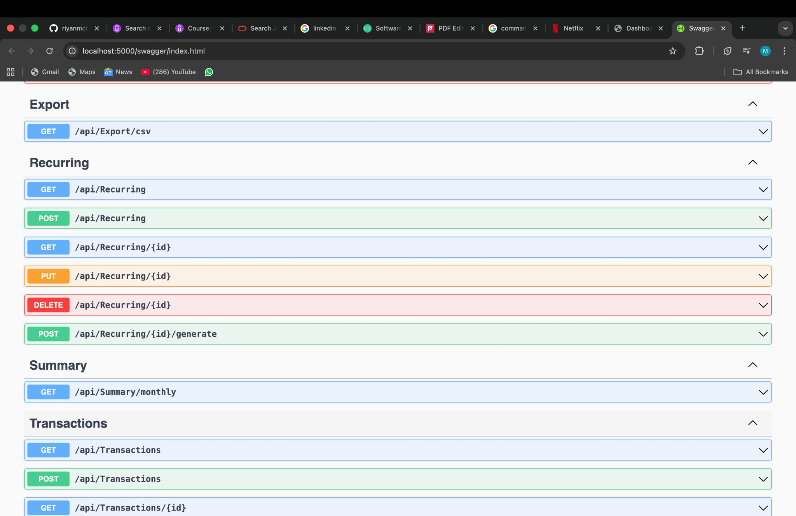

# 💰 ExpenseTracker

**Track income and spending, set budgets, and export your data—all in one place.**

A full-stack app with a simple web interface and a ready-to-use API. Pick a month, see your totals, where your money went, and how you’re doing against your budgets. Add one-off or recurring transactions, then export everything to CSV when you need it.



---

## What you get

- **Dashboard** — Choose any month and year. See total income, total expenses, and balance at a glance. Spending by category and budget progress show up right there.
- **Transactions** — Log income or expenses with amount, date, note, and category. Filter by date range and category.
- **Categories** — Create your own (e.g. Food, Transport, Salary) with an icon and color. Use them for transactions and budgets.
- **Budgets** — Set a monthly limit per category. The dashboard shows how much you’ve spent vs your limit.
- **Recurring** — Define weekly or monthly items (rent, salary, subscriptions). One click generates the actual transactions up to today so you don’t have to add them by hand.
- **Export** — Download your transactions as CSV for the selected period from the dashboard.

Everything is available both in the UI and through the API, so you can build scripts or integrate with other tools if you want.

---

## Try the API in your browser

When you run the app, the **API** button in the nav opens a live API explorer. You can list budgets and categories, add or edit transactions, trigger recurring generation, get the monthly summary, or download CSV—all from the browser, no command line or Postman required.

| Budgets & categories | Export, recurring, summary & transactions |
|----------------------|------------------------------------------|
|  |  |

---

## Run it locally

**Prerequisites:** [.NET 9 SDK](https://dotnet.microsoft.com/download) (or .NET 8 if you prefer; adjust the project target if needed).

```bash
git clone https://github.com/YOUR_USERNAME/expense-tracker.git
cd expense-tracker
dotnet restore
dotnet run --project src/ExpenseTracker.Api
```

> **Repo name idea:** `expense-tracker` (simple and discoverable). Alternatives: `ExpenseTracker` (matches the solution name) or `personal-expense-tracker`.

Then open **http://localhost:5000** in your browser. The first run creates a local SQLite database and seeds a few default categories (Food, Transport, Salary, Shopping).

- **Web app:** http://localhost:5000  
- **API explorer:** http://localhost:5000/swagger  

---

## Tech stack

| Part | What’s used |
|------|-------------|
| **Web UI** | ASP.NET Core, Razor Pages, Bootstrap 5 |
| **API** | ASP.NET Core Web API, OpenAPI (interactive docs at `/swagger`) |
| **Data** | Entity Framework Core, SQLite |
| **Structure** | Clean layers: Core (entities, interfaces), Infrastructure (data access), API (controllers + pages) |

---

## API at a glance

The backend exposes endpoints for:

- **Categories** — List, get one, create, update, delete.
- **Transactions** — List (with optional date range and category filter), get one, create, update, delete.
- **Budgets** — List, get one, create, update, delete.
- **Recurring** — List, get one, create, update, delete, and **generate** (create actual transactions from a recurring template up to today).
- **Summary** — Monthly summary: income, expense, balance, by category, and budget progress.
- **Export** — CSV download for a given period.

You can use these from the in-browser API explorer (link in the app’s nav) or from any HTTP client.

---

## License

MIT.
